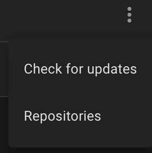
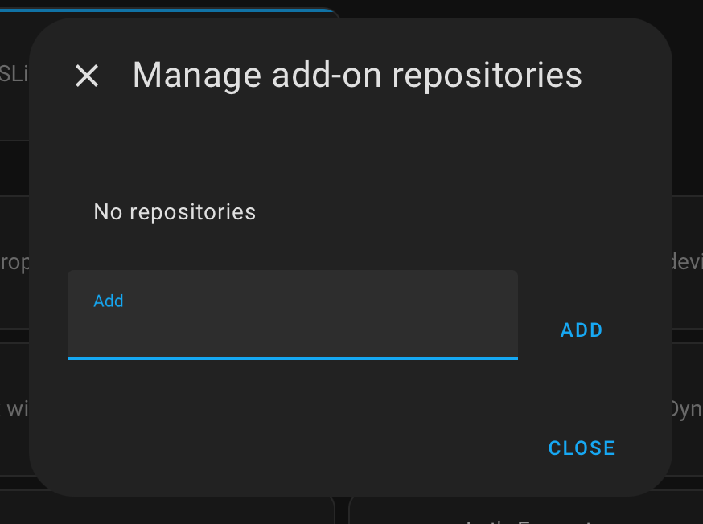
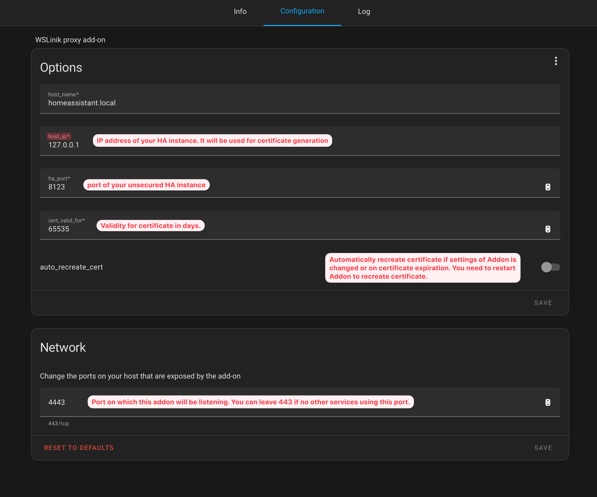

# WSLink Addon for Home Assistant

## Introduction

The WSLink addon for Home Assistant serves as a bridge, enabling SSL communication between your weather station and Home Assistant. This allows seamless data transfer even when Home Assistant isn't configured to accept SSL directly.

## :sparkles: Features

- **SSL Proxy**: Facilitates secure communication using SSL.
- **Sensor Integration**: Bridges weather data to pass to Home Assistant sensors.

## :arrow_down: Installation

### Via UI

#### You need to add this repository to Addon store

1. Navigate to "Add-ons" in your Home Assistant dashboard.
2. Click `Add-on store` button

3. In top right corner select three dots and `Repositories`

4. Add link to this repository `https://github.com/schizza/wslink-addon.git`

5. Refresh your page
6. Select WSLink Addon and install it.

### Manual Installation

1. Clone the repository: `git clone https://github.com/schizza/wslink-addon.git`.
2. Copy the directory to `/usr/share/hassio/addons/local/` on your system.

## :wrench: Configuration

In `configuration tab` set right settings.

- `Host name`: DNS name for your Home Assistant instance. You can leave `homeassistant.local` if you do not have DNS record for your installation.
- `HA port`: is unsecured port, where Home Assistant is listening.
- `cert valid for`: Validity of self-signed certificate in days. Certificate is created within add-on's container.
- `auto recreate certificate`: Enable this if you want automatic recreation of certificate on settings change or on certificate expiration. _Note: you have to restart this addon to recreate certificate._

## :necktie: Usage

1. **Start Add-on**: From the add-ons page, click "Start".
2. **Check Logs**: Monitor logs for connection status and data flow.
3. **Set SWS12500 Integration**: Update your SWS12500 integration settings to accept connections on WSLink route.
4. **Verify Data**: Ensure weather data appears in Home Assistant sensors.

## Uninstallation

1. Stop the add-on via its settings.
2. Uninstall from the add-ons section.
3. Remove any local files if installed manually.
4. Reconfigure SWS12500 integration to not listen for data on WSLink route.

## :technologist: Contributing

Contributions are welcome! Create an issue before starting a feature to discuss ideas.

## :page_facing_up: License

This project is MIT Licensed. See [LICENSE](LICENSE) for details.
